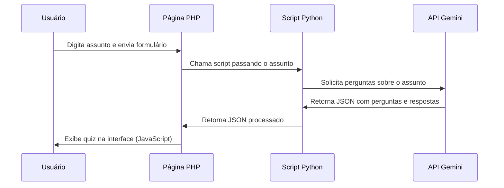

# 🎮 Quiz Game com Gemini API

<div align="center">
  
  
  
  
  
  <br>
  
  
  
  <br>
  
</div>
  
  <br>

# Um jogo de quiz interativo que utiliza a API Gemini do Google para gerar perguntas e respostas sobre qualquer assunto!


## 📋 Índice

- [📝 Descrição](#-descrição).
- [✨ Funcionalidades](#-funcionalidades).
- [🙋 Segurança de conteúdo retornado](#-seguranca-de-conteudo-retornado).
- [🛠️ Tecnologias Utilizadas](#-tecnologias-utilizadas).
- [🚀 Recursos](#-recursos).
- [🔧 Instalação](#-instalação).
- [⚙️ Configuração](#️-configuração).
- [📝 Como Usar](#-como-usar).
- [🔄 Fluxo de Funcionamento](#-fluxo-de-funcionamento).
- [🎨 Personalização](#-personalização).
- [❓ Solução de Problemas](#-solução-de-problemas).
- [⚠️ Limitações](#️-limitações).
- [🔒 Segurança](#-segurança).
- [🔮 Próximos Passos](#-próximos-passos).
- [📄 Licença](#-licença).

## 📝 Descrição

O **Quiz Game com Google Gemini API** é uma aplicação web interativa que utiliza a poderosa API Gemini do Google para gerar quizzes personalizados sobre qualquer assunto escolhido pelo usuário. Este projeto demonstra a integração entre tecnologias web (PHP, JavaScript, HTML/CSS) e inteligência artificial para criar uma experiência de aprendizado dinâmica e envolvente.

## ✨ Funcionalidades

- 🧠 **Geração de quizzes por IA**: Utiliza o modelo Gemini da Google para criar perguntas e respostas inteligentes
- 🌐 **Interface web responsiva**: Design moderno e adaptável a diferentes dispositivos
- 🎯 **Perguntas contextualizadas**: Cada pergunta inclui a resposta correta, alternativas plausíveis e explicação detalhada
- ⚡ **Processamento assíncrono**: Utiliza AJAX para uma experiência de usuário fluida
- 🛡️ **Tratamento robusto de erros**: Validação em todos os níveis da aplicação

## 🙋 Segurança de conteúdo retornado

- O código inclui filtros que previnem o retorno de conteúdo que signifiquem dano ou ofença em 5 categorias:
  - **Discurso de ódio**: Comentários negativos ou nocivos voltados à identidade e/ou atributos protegidos.
  - **Assédio**: Comentários ameaçadores, intimidadores, abusivos ou violentos direcionados a outra pessoa.
  - **Sexualmente explícito**: Contém referências a atos sexuais ou outro conteúdo sexual.
  - **Conteúdo perigoso**: Promove, facilita ou incentiva atos nocivos.
  - **Integridade cívica**: Conteúdo que pode ser usado para prejudicar a integridade cívica, com assuntos sobre eleições, políticas públicas, pessoas públicas, etc.

Portanto, qualquer assunto pesquisado na página, não retornará qualquer ofença ou violação destas 5 categorias.

## 🛠️ Tecnologias Utilizadas

- **Backend**:
  - **Python 3.x**: Linguagem principal para interação com a API Gemini
  - **Google Gen AI SDK**: Biblioteca oficial para acesso à API Gemini
  - **PHP**: Processamento do lado do servidor e integração com Python

- **Frontend**:
  - **HTML5/CSS3**: Estrutura e estilização da interface
  - **JavaScript**: Manipulação do DOM e processamento assíncrono
  - **Design Responsivo**: Layout adaptável a diferentes tamanhos de tela

## 🚀 Recursos

- ✅ **Geração Dinâmica de Quiz**: Crie quizzes sobre qualquer assunto instantaneamente
- ✅ **Integração com IA**: Utiliza a API Gemini do Google para gerar conteúdo de alta qualidade
- ✅ **Design Responsivo**: Interface amigável para dispositivos móveis e desktop
- ✅ **Respostas Embaralhadas**: Ordem aleatória das alternativas para cada pergunta
- ✅ **Explicações Detalhadas**: Cada pergunta inclui uma explicação da resposta correta

## 🔧 Instalação

### Pré-requisitos

- Servidor web com suporte a PHP
- Python 3.x
- Biblioteca `google-genai` do Python
- Chave de API do Google Gemini

### Passos para Instalação

1. Clone este repositório:
   ```bash
   git clone https://github.com/seu-usuario/quiz-game-gemini.git
   cd quiz-game-gemini
   ```

2. Instale a biblioteca Python necessária:
   ```bash
   pip install google-genai
   ```

3. Dê permissão de execução ao script Python:
   ```bash
   chmod +x generate_quiz.py
   ```

4. Configure sua chave de API (veja a seção de Configuração abaixo)

5. Copie os arquivos para o diretório do seu servidor web

## ⚙️ Configuração

### Configuração da API Gemini

1. **Obtenha uma chave de API**:
   - Acesse [Google AI Studio](https://makersuite.google.com/app/apikey)
   - Crie uma nova chave de API

2. **Configure a variável de ambiente**:
   ```bash
   # Temporariamente
   export GOOGLE_API_KEY="sua-chave-aqui"
   
   # Permanentemente (adicione ao .bashrc ou similar)
   echo 'export GOOGLE_API_KEY="sua-chave-aqui"' >> ~/.bashrc
   source ~/.bashrc
   ```

### Configuração do Servidor Web

1. **Permissões**:
   - Certifique-se de que o usuário do servidor web (geralmente www-data) tenha permissão para executar o script Python
   ```bash
   chown www-data:www-data generate_quiz.py
   chmod 755 generate_quiz.py
   ```

2. **Configuração do PHP**:
   - Verifique se o PHP está configurado para permitir a execução de comandos shell via `shell_exec()`
   - Isso pode ser verificado/configurado no arquivo `php.ini` (função `shell_exec` não deve estar na lista `disable_functions`)

## 📝 Como Usar

1. Acesse o arquivo `index.php` através do navegador
2. Digite um assunto para o quiz no campo de texto (ex: "História do Brasil", "Astronomia", "Inteligência Artificial")
3. Clique em "Gerar Quiz" e aguarde o processamento
4. Os resultados serão exibidos na página
5. Explore as perguntas, respostas e explicações geradas pela IA

## 🔄 Fluxo de Funcionamento



## 🎨 Personalização

### Estilo e Aparência

Você pode modificar o CSS no arquivo `index.php` para personalizar a aparência do quiz:

```css
:root {
    --primary-color: #4a6fa5;    /* Cor principal */
    --secondary-color: #166088;  /* Cor secundária */
    --accent-color: #4fc3dc;     /* Cor de destaque */
    /* Outras variáveis de cor... */
}
```

### Número de Perguntas

Para alterar o número de perguntas geradas, modifique o arquivo `generate_quiz.py`:

```python
# Altere "20 perguntas" para o número desejado
prompt = f"""
Crie um quiz com 10 perguntas sobre o assunto: {subject}.
...
"""
```

### Formato das Perguntas

Você pode modificar o prompt no arquivo `generate_quiz.py` para alterar o formato ou conteúdo das perguntas:

```python
prompt = f"""
Crie um quiz com 20 perguntas sobre o assunto: {subject}.
Para cada pergunta, forneça:
1. A pergunta
2. A resposta correta
3. Três respostas erradas plausíveis
4. Uma explicação detalhada
...
"""
```

## ❓ Solução de Problemas

| Problema | Possível Causa | Solução |
|----------|---------------|---------|
| "Script Python não encontrado" | Caminho incorreto ou permissões | Verifique o caminho e as permissões do script |
| "API Key não encontrada" | Variável de ambiente não configurada | Configure a variável `GOOGLE_API_KEY` |
| Resposta em branco | Erro no script Python | Verifique os logs do servidor |
| JSON inválido | Formato incorreto da resposta | Verifique o formato da resposta da API |
| Tempo limite excedido | Resposta lenta da API | Aumente o tempo limite do PHP |

## ⚠️ Limitações

- O script depende da disponibilidade e dos limites da API Gemini
- O tempo de resposta pode variar dependendo da carga na API
- A qualidade das perguntas e respostas depende do modelo de IA utilizado
- Atualmente limitado a 20 perguntas por quiz

## 🔒 Segurança

- O código inclui escape de shell para evitar injeção de comandos
- Recomenda-se implementar medidas adicionais de segurança em ambiente de produção:
  - Implementar autenticação de usuários
  - Limitar o número de requisições por IP
  - Utilizar HTTPS para todas as comunicações
  - Validar e sanitizar todas as entradas de usuário
 
## 🔮 Próximos Passos

- [ ] Implementar Google Search
- [ ] Implementar sistema de pontuação
- [ ] Adicionar temporizador para as perguntas
- [ ] Salvar histórico de quizzes gerados
- [ ] Implementar categorias pré-definidas
- [ ] Adicionar modo multijogador
- [ ] Criar sistema de ranking
- [ ] Exportar quiz para PDF ou compartilhar nas redes sociais

## 📄 Licença

Este projeto está licenciado sob a [Licença MIT](LICENSE) - veja o arquivo LICENSE para detalhes.

---

<div align="center">
  <p>
    <i>Desenvolvido com ❤️ por Marcos Leão/Bambu Eventos</i>
  </p>
  <p>
    <a href="https://github.com/seu-usuario">GitHub</a> •
    <a href="https://seu-site.com">Website</a> •
    <a href="mailto:seu-email@exemplo.com">Contato</a>
  </p>
</div>
